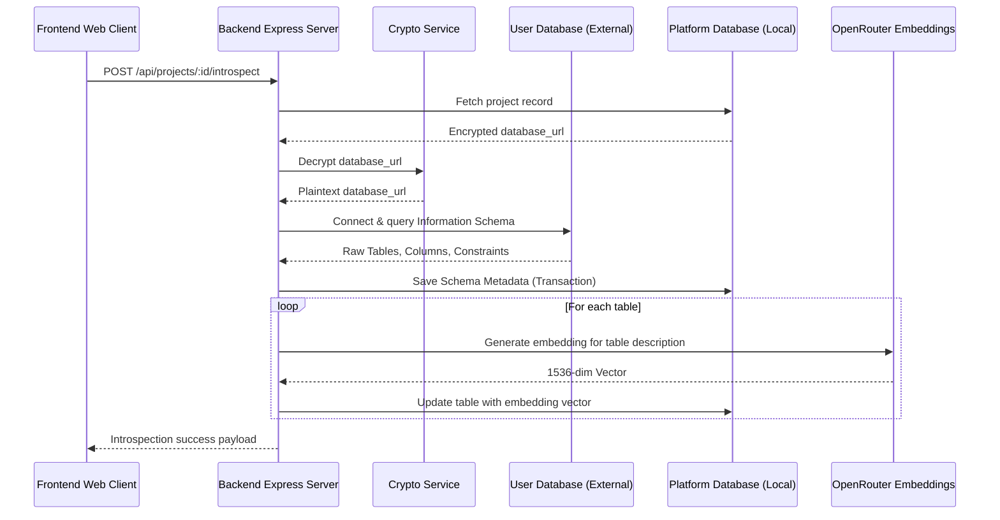
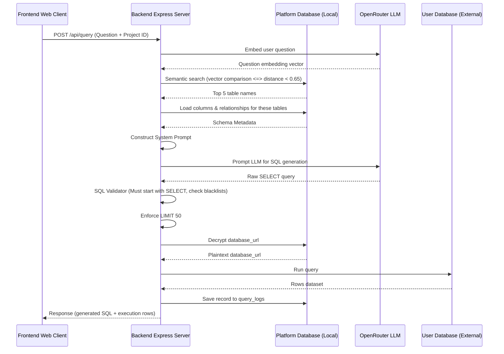
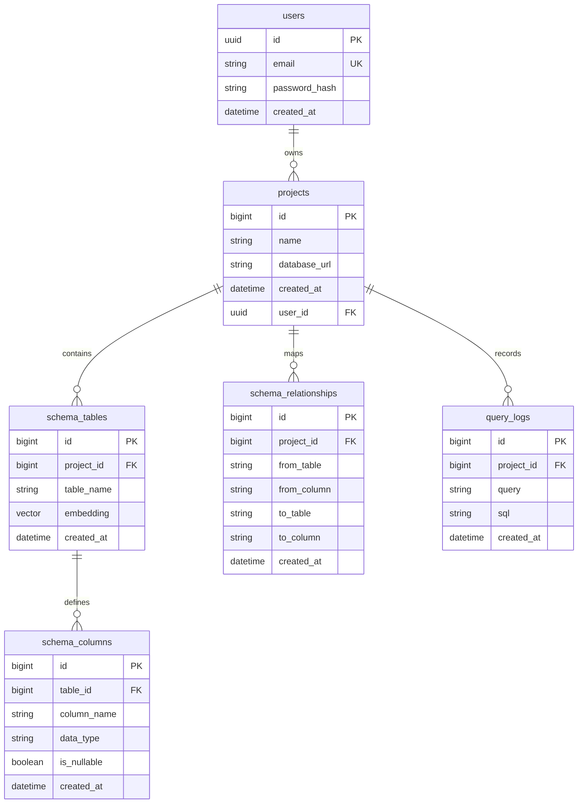

# 🐘 PostgreSQL Query Assistant

An AI-powered developer tool that allows you to connect PostgreSQL databases, ask questions in natural language, and safely generate, explain, and execute read-only SQL queries. 

It is schema-aware, uses semantic vector embedding lookup for optimal context generation, and features strict SQL validation sandboxing to guarantee secure, read-only operations.

---

## 🌟 Key Features

1. **Secure Database Connections**: Users connect target databases securely. Connection strings and passwords are encrypted in the platform database using AES-256-CBC.
2. **Schema Auto-Introspection**: Introspects public tables, column types, nullability, and primary/foreign key constraints automatically.
3. **Semantic Table Indexing**: Generates semantic embeddings of tables and their column definitions using OpenAI embeddings (via OpenRouter) and stores them in the platform database utilizing the `pgvector` extension.
4. **Context-Aware SQL Generation**: Combines the user's natural language question with relevant schemas resolved using semantic vector lookup, forming a prompt to output high-accuracy SELECT queries.
5. **Multi-Stage Security Sandbox**:
   - Restricts queries to `SELECT` operations.
   - Rejects statements containing data-modification keywords (`INSERT`, `UPDATE`, `DELETE`, `DROP`, `ALTER`, `TRUNCATE`, `CREATE`, etc.).
   - Automatically appends a `LIMIT 50` clause if no query limit is specified to prevent server memory saturation.
6. **Web Dashboard Workspace**: Responsive React interface for managing projects, inspecting schemas, and running questions interactively inside a query assistant terminal.

---

## 🏗️ System Architecture

The project consists of a **TypeScript/Express Backend** and a **React/Vite Frontend**.

### The Two-Database Concept

```
┌─────────────────────────────────────────────────────────────┐
│                 PostgreSQL Query Assistant                  │
│                                                             │
│   ┌──────────────────────────┐   ┌──────────────────────┐   │
│   │  1. Platform Database    │   │   2. User Database   │   │
│   │   (PostgreSQL + vector)  │   │     (Read-Only)      │   │
│   ├──────────────────────────┤   ├──────────────────────┤   │
│   │ Stores users, projects,  │   │ Customers' database  │   │
│   │ encrypted db credentials,│   │ inspected for schema │   │
│   │ tables/column metadata,  │   │ and used to execute  │   │
│   │ embeddings & query logs. │   │ safe SELECT queries. │   │
│   └──────────────────────────┘   └──────────────────────┘   │
└─────────────────────────────────────────────────────────────┘
```

*   **Platform Database**: Managed by the app backend to store system configuration (users, projects, credentials, schema metadata). It has `pgvector` enabled to perform cosine similarity lookups over schema representations.
*   **User Database**: External client database that the user connects. The assistant only performs introspection and read-only SELECT query execution. **Migrations or write actions are never performed on the user database.**

---

## 🛠️ Tech Stack

### Backend
*   **Runtime & Language**: Node.js, TypeScript
*   **API Framework**: Express (hardened with Helmet and rate-limiters)
*   **Database ORM**: Prisma (connecting to the platform PostgreSQL instance)
*   **Direct Database Client**: `pg` (node-postgres to run queries against external user databases)
*   **AI Integrations**: OpenRouter API (utilizing OpenAI models for text embeddings and SQL generation)
*   **Vector Search**: PostgreSQL `pgvector` extension (using the cosine distance `<=>` operator)
*   **Cryptography**: Node.js standard `crypto` module (AES-256-CBC encryption)

### Frontend
*   **Bundler & Framework**: Vite, React, TypeScript
*   **Styling**: Tailwind CSS & shadcn/ui
*   **Navigation**: React Router (v7)
*   **Theme**: Dark/Light mode theme system

---

## 🔄 Core Workflows

### 1. Schema Introspection & Indexing Pipeline

When a user creates a project or clicks "Refresh Schema":
1.  **Read Project**: The API retrieves the project record from the platform database.
2.  **Decrypt URL**: The user database connection string is decrypted using the platform's `ENCRYPTION_KEY` (AES-256-CBC).
3.  **Run Introspector**: A node-postgres `Client` connects to the **User DB** and runs queries against `information_schema.tables`, `information_schema.columns`, and `information_schema.table_constraints`.
4.  **Save Metadata**: Results are normalized and saved to `schema_tables`, `schema_columns`, and `schema_relationships` in a single transaction.
5.  **Generate Embeddings**: For each table, a descriptor string is compiled (e.g. `table: orders, columns: id (integer), customer_id (integer), total (numeric)`). The backend calls OpenRouter (`openai/text-embedding-3-small`) to generate a 1536-dimensional vector embedding.
6.  **Store Vectors**: The embedding array is serialized and saved as a Postgres vector inside `schema_tables.embedding`.



### 2. Natural Language to SQL Execution Pipeline

When a user submits a question in the query workspace:
1.  **Retrieve Question Embedding**: The API requests the vector embedding of the user's question via OpenRouter.
2.  **Semantic Table Search**: Runs a query comparing the question embedding against `schema_tables.embedding` using cosine distance (`<=>`). It returns up to 5 tables matching a similarity threshold `< 0.65`.
3.  **Load Active Schema**: Retrieves schema details (columns, data types, nullability) and active table relationships for the matched tables. If no tables are semantically matched, it defaults to loading the full schema.
4.  **Prompt Construction**: Generates a context-aware system prompt containing active tables, columns, foreign-key relationships, and strict generation constraints.
5.  **LLM Execution**: Sends the system prompt to OpenRouter (using `openai/gpt-oss-120b:free` or equivalent model) to generate raw SQL.
6.  **Security Inspection**:
    *   Inspects the output SQL. It must start with `SELECT` (case-insensitive).
    *   Asserts that it contains no blacklisted keywords (`INSERT`, `UPDATE`, `DELETE`, `DROP`, `ALTER`, etc.).
7.  **Enforce Row Limits**: Modifies the query to ensure it concludes with a `LIMIT 50` clause unless a specific limit was explicitly requested.
8.  **Execute SQL**: Decrypts the target database connection string, initializes a connection client, executes the safe SELECT query, writes query details to `query_logs`, and returns the results to the user UI.



---

## 💾 Database Schema

The platform PostgreSQL database uses the following schemas (managed via Prisma):



---

## 🔒 Security Design

1.  **Data at Rest Encryption**: Database connection URLs are encrypted in transit and stored at rest inside the platform DB as ciphertexts (using standard AES-256-CBC inside `src/utils/crypto.ts`).
2.  **strict SELECT Validation**: The query pipeline enforces a strict whitelist-blacklist policy inside `src/modules/query-assistant/sql-validator.ts`. Queries that do not start with `SELECT` or contain DDL/DML keywords (`INSERT`, `UPDATE`, etc.) are blocked.
3.  **Client Principle of Least Privilege**: Users are recommended to connect to their external databases using database users configured with read-only roles (e.g. `pg_read_all_data` or standard SELECT privileges).
4.  **Rate Limits**:
    *   Globally restricted to 100 requests/minute.
    *   Auth registration limit: 5 requests/hour.
    *   Auth login limit: 10 requests/minute.
    *   SQL generation: 20 query execution requests/minute.

---

## ⚙️ Local Installation & Setup

### Prerequisites
*   [Node.js](https://nodejs.org/) (v18+)
*   [PostgreSQL](https://www.postgresql.org/) database server with the `pgvector` extension.

### 1. Platform Database Setup
Connect to your local or hosted PostgreSQL instance that will act as your platform DB, and enable the necessary extensions:
```sql
CREATE EXTENSION IF NOT EXISTS vector;
CREATE EXTENSION IF NOT EXISTS pgcrypto;
```

### 2. Environment Configuration
Create a `.env` file in the project **root** directory:
```env
PORT=4000
DATABASE_URL="postgresql://<username>:<password>@localhost:5432/<platform_db_name>?schema=public"
FRONTEND_URL="http://localhost:5173"
ENCRYPTION_KEY="your-encryption-key-32-chars-!!"
OPENROUTER_API_KEY="your-openrouter-key"
```
*Make sure `ENCRYPTION_KEY` is exactly 32 characters long.*

Create a `.env` file in the `frontend/` directory:
```env
VITE_API_URL="http://localhost:4000"
```

### 3. Install Dependencies
Run the following commands to install packages for the backend and the React frontend:
```bash
# Install root/backend dependencies
npm install

# Install frontend dependencies
cd frontend
npm install
cd ..
```

### 4. Database Setup & Migrations
From the root directory, generate the Prisma Client code and apply the migrations/sync to the platform database:
```bash
npx prisma generate
npx prisma db push
```

### 5. Running the Application
Open two separate terminal windows:

**Start Backend API (Root folder):**
```bash
npm run dev
```
The API server will launch at `http://localhost:4000`.

**Start Frontend Application (Frontend folder):**
```bash
cd frontend
npm run dev
```
The Vite development server will launch at `http://localhost:5173`.
